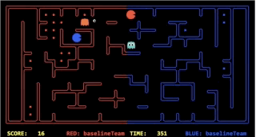

# AI Method 1 - Heuristic Search Approach

# Table of Contents
- [Heuristic Search](#governing-strategy-tree)
  * [Motivation](#motivation)
  * [Application](#application)
  * [Trade-offs](#trade-offs)     
     - [Advantages](#advantages)
     - [Disadvantages](#disadvantages)
  * [Future improvements](#future-improvements)

## Heuristic Search  

### Motivation 

This problem has two properties that make A Star Search with heuristic an ideal approach.

1. The plan to reach the final goal of the game, winning the game, is constantly changing due to the involvement of the unpredictable opponent. Thus, some static sub-goals that help with getting close to the winning state must be formalized. Given proper cost function, A Star Search can find a satisfying path to the sub-goal, for example, the shortest path to the nearest food.

2. Even sub-goals such as eating the next nearest food are static, the cost of reaching the goal subjects to change because of the appearance of the opponent. So, the cost must be re-evaluated dynamically on each step according to the environment. And the searching space is fairly large if the sub-goal is not nearby. 

The above properties of the game inspire us to take advantage of heuristic function to reduce searching space and focus more on the most promising paths.

[Back to top](#table-of-contents)

### Application

In our implementation, we divide the final goal of winning the game into three parts. Based on them, three heuristic functions are developed.

	1.
	Goal: finding food to eat
	Heuristic: large for states near a ghost or having small noisy distance, small for positions near an invader and foods

	2.
	Goal: finding entrances or capsules while been chasing
	Heuristic: large for positions near a ghost, small for positions near a entrances or capsules

	3.
	Goal: finding invaders while all foods have been targetted by a teammate.
	Heuristic:  small for states near an invader, having small noisy distance or near the position where food just been eaten by an invader.

The first one is intuitive since the best way to win the game is to take the shortest path to every food while avoiding ghosts.

The second goal will be applied when a Pacman is chasing by a ghost. We resort to the last two observed states to determine whether a Pacman is chased. If the mazeDistance between a Pacman and a ghost is not getting bigger for the last three states and the ghost is within the dangerous distance, the state variable isChased will set to be true. In this situation, there is no other choice for this agent to get safe unless it goes for a capsule or entrance.

The third goal is under the situation that a Pacman's teammate is closer to all the foods than it is or there are less than two foods left. when that happens it will go to defence mode and searching for invaders. This goal makes the two agents can collaborate. Since, once a food has been targetted by one agent(closer to that food than its teammate), another agent will choose target among the rest and go to defence invader if all foods have been targetted.

On each step, the current state variables, including isChased, ondefence and enemy position information, will be updated and recorded. The goal and heuristic applied in A Star Search will be selected according to the aforementioned conditions.

[Back to top](#table-of-contents)

### Trade-offs  
#### *Advantages*  

The first advantage of using heuristic is that there are some circumstances that an agent certainly wants to avoid, such as been eaten by the ghosts. By giving the states that in positions near a ghost a large heuristic value, they will get a low priority in the searching tree. In this way, the agent will aim for a path that reaches food and away from ghosts. And, by giving the positions near invaders a low heuristic value, the agent will prefer the path which has invader on the way, which increases the chance of catching the enemy.

The second advantage of heuristic over MTCs is that it certainly can find a goal on every step, and move toward the goal based on the changing environment. While, for MTCs, the simulation process will not converge if the goal is too deep in the tree. 

As mentioned in the application section, the introduction of the third goal somehow gives the agents ability to cooperate with each other according to the situation of the game, although they have separate goals, they benefit each other to get better overall results. This gives birth to some combat strategies such as seducing ghosts to make a chance for a teammate to get food or going to eat a capsule to save a teammate's life.

#### *Disadvantages*

The A-Star Searching algorithm with heuristic is very rigid in the sense that as long as the calculation result doesn't change the next move taken the agent will not change. This may cause agents stuck in a loop when a ghost around it(Demo 1). In this case, the two opposite agents can be seen as in a nashi equilibrium and they will be stuck in the situation until other events turn up and break the loop. In the case of the demo video, the tiebreaker is the blue Pacman.

Another disadvantage of this method is that the agents are obsessed with getting the food with the shortest path, even it's obviously gonna encounter a ghost on the path. They are not aware of the enemy until they are very close to the enemy and the heuristic is big enough for them to detour which waste all the steps it had taken so far.

[Back to top](#table-of-contents)

### Future improvements 

As we have observed, the area that agents can get stuck with an enemy is aways around the boundary in the middle of the map. Another logic can be added to determine whether the agent been stuck in a loop and once it's true, heading for the next entrance.

[Back to top](#table-of-contents)

[Previous Page](/2_0_design_choices) | [Next Page](/2_2_approach)