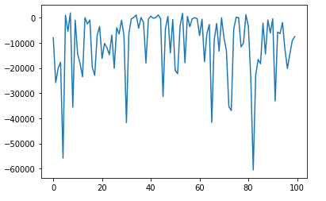

# AI Method 2 - Q-learning with Linear Function Approximation 

# Table of Contents
- [Q-learning with Linear Function Approximation](#governing-strategy-tree)
  * [Motivation](#motivation)
  * [Application](#application)
  * [Trade-offs](#trade-offs)     
     - [Advantages](#advantages)
     - [Disadvantages](#disadvantages)
  * [Future improvements](#future-improvements)

## Governing Strategy Tree  

### Motivation 

The gist of the game is to collect foods and score as fast as possible and avoid enemies. However, it's not clear what strategy should be followed by the agents to complete this task. It's obvious that for a changing environment like this game, the best way to find a general strategy is to use reinforcement learning and let agents learn by playing.

It's also self-explanatory that all the events that help with winning can be deemed as rewards. Q-learning has the capability of improving Q value to generate the best strategy. 

We design the agents by using Q-learning with linear approximation. The reason for using approximation is that the rewards are very far away at the start of the game, the training process of traditional Q-learning is impossible to converge with rewards that far. The reason for choosing linear is for the purpose of simplicity and easy computation.  
[Back to top](#table-of-contents)

### Application

We design the Q-learning agent based on the same logic as the heuristic search agent. But this time, instead of heuristic, we formalize features as a linear model to guide our search. The rewards and features expressed in our python program are listed below:

Rewards:
foodBeenEaten: 5, score: number of food carrying * 3, agentBeenEatenBy Ghost: -number of food carrying * 5 - 30, eatInvader: 30

Features:
foodLeft: The total number of foods left on the grid.
distanceToFood: The maze distance to the nearest food.
distanceToGhost: The distance to the nearest ghost.
distanceToInvader: The distance to the nearest invader
distanceToEntrance: The distance to the nearest entrance
bias: Always be 1, for the sake of normalization

The weights are initialized to be 1 for all the features. They are updated at the start of each step based on the rewards and Q-value of the previous step.

To strengthen the idea of collaboration between the agents, we assign different rewards to the two agents to make one of them get high rewards by being aggressive to collect food and another one by defending against an invader.

[Back to top](#table-of-contents)

### Trade-offs  
#### *Advantages*  

1. The time required for an agent to make a decision on each step is much shorter. 
2. The agent is more strategic, it can somehow change their strategy by updating their parameter based on what happens in the current game so far. That shows the capability of learning an opponent's behavior.
3. The agent is more flexible. The same agent can be adapted to normal Pacman game just by training it with a few plays of the game. The model can be made more specific by taken into consideration more features.

#### *Disadvantages*

1. The linear model is too rigid that it has the same problem of stuck in a loop.
2. The parameters are updated on every step. This causes the parameter to diverge very fast. To reduce the growing speed, the feature has to be normalized. 
3. After normalization, although, the parameter can change at a reasonable rate, the training can't converge(diagram 1). The picture shows the training reward fluctuates through 100 training sessions with no converging tendency. 

We observed that the agents are pretty much changing the weights based on what happened recently. For example, if the agent got eaten by a ghost, the weight of the feature corresponding to the distance from ghost will get bigger to keep the agent away from ghosts. But after it eats some food and not get eaten, the weight will get larger again which makes it more aggressive. 
On the one hand, this characteristic helps the agent adapt to the opponent's behaviour and improve it's strategy accordingly. On the other hand, it decreases the generalization ability of the model, which means, it cannot learn a fixed model against all kinds of enemies. 

One reason for this drawback is that the linear model's complexity is not enough to model the complexity of the game. It can be easily identified that the decision-making process is not linear in the sense that many features have some subtle correlation with each other.

4. Same as the heuristic approach, the agent is unaware of the opponent's intention. Because it cannot see far into the future, sometime it may waste strength to explore an unpromising path that may attract a ghost's attention.

[Back to top](#table-of-contents)

### Future improvements  

For disadvantage 3, more advanced machine learning models such as neural networks can be used to model the complicated relation between features.

For the problem of weights not converging, the updating can be taken after a batch of actions instead of just one. The best way is to backpropagate the updating until the end of the game, however unrealistic given the limited computing resource we have.

[Back to top](#table-of-contents)

[Previous Page](/2_1_approach) | [Next Page](/3_approach_evolution)