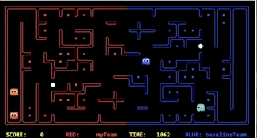
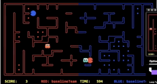
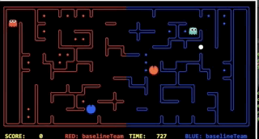
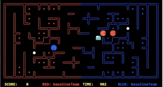
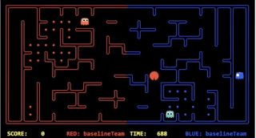
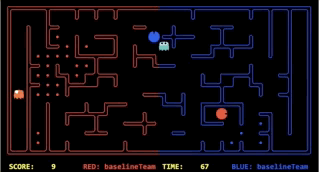
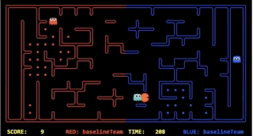
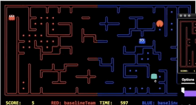
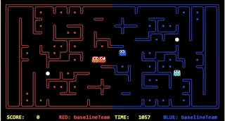

# Evolution of the approach

## My First Agent - Monte Carlo Tree Search
----

The first agent we implemented is the Monte Carlo Tree Search agent with only eating food as rewards. We hope the agent can start exploring the rewards and choose the action with the largest Q value. However, we observe that since the rewards are very far away at the start, the agent failed to move towards the food, and end up taking random action at each step(Demo 1).

After analyzing, we found out the reason behind the weird agent's behaviour is that the reward is too deep in the search tree. In the roll-out phase of the algorithm, it's unable to expand to a reward, which makes all available actions have an equal Q-value of zero.

Based on the observation, we improve the agent by limit the expansion depth to be 5 and add distance to food and ghost as a reward. The outcome agent is aware of both food and ghost(Demo 2). However, occasionally, the agent will move towards ghost which makes it been eaten. The reason originates from the fact that the agent cannot predict the opponent's move. For example, when deciding which action to take next, the agent will simulate future action by a random-choice roll out policy. As long as from a position, there is a path leading to food, the searching algorithm tends to exploit this path more, even though this position makes it getting closer to a ghost. 

The above problem of the agent can be resolved by using formalize a rollout policy to avoid ghosts or to predict opponents' intentions. We tried the second approach, which leads to the Monte Carlo Tree Search with Goal Recognition techniques we will explain in the next section.

### Demo

#### Strategy summary

| Pros | Cons |
|-----------------|:-------------|
| Model Free | computationally and memory expensive  |
| Variable runtime     | hard to decide the best searching depth   |
| Reusable tree     |unaware of opponent's intention  |
| No need for an evaluation function | Rewards formalization takes effort  |
----
## My Second Agent - Monte Carlo Simulation with Goal Recognition
----

For the sake of simplicity, we make the assumption that the opponent will take actions that minimize the agent return and the teammate will take actions that maximize its return. And future rewards have a discount factor of 0.9. That is to say, choose the current action that maximizes the minimum rewards. Since the tree expansion involving the opponent is memory expensive, we limit the search depth to be 3. And because of this cutoff, an evaluation function is required to determine how good the current state is.

The outcome of this approach is that the agent can notice the approaching ghost and try to get away from it (Demo 1, the orange agent). In most cases, once the agent been chased, it should go for entrance immediately, because there is no way to get rid of the chaser unless doing so. However, in this version of this implementation, even been chased the agent still tries to grab more foods which make it get closer and closer to the ghost or even been trapped in a tunnel that it can't get away(Demo 1, the red agent).
### Demo

#### Strategy summary

| Pros | Cons |
|-----------------|:-------------|
| Aware of opponent's intention | Unaware of chasing  |
| Fast computation     |   complex evaluation function       |

----

## My Third Agent - Heuristic Search Agent
----

As specified in [2.1](/2_1_approach), the outcome of this agent is quite promising and shows a few new strategies compared to the previous methods. Some interesting characteristics are observed:

1. Go for capsule when get chased(Demo 1, Demo 2)

2. Come back to get score when been chased and no capsule left(Demo 3)

3. Put back food before times up(Demo 4)

4. Go for food while teammate draw ghost's attention(Demo 5)

#### Competition results: Position - 1/50 | Percentile - 2%

#### Strategy summary

| Pros | Cons |
|-----------------|:-------------|
|Heuristic give a low-cost path to a goal | computationally expensive  |
|  offer a quick solution    |   lack flexibility       |
|  Get as much as food as possible through teamwork    |   cannot recognize tunnel, easily get trapped       |

----

## My Fourth Agent - Q-learning Agent
----

As specified in [2.2](/2_2_approach), since we stick with the logic we are using in the heuristic search the behavior of the agent is pretty much the same, except that Q-learning Agent behaves more randomly and can change strategy according to opponent's behaviors. 

Another improvement of Q-learning over Heuristic is that since we assign different reward values to the two agents, one of the agents is more conservative and can avoid tunnel(Demo 1). 

Compared with a heuristic search whose agent only put back food when it is chased, when a Q-learning agent will do it totally depends on the value of the linear model. So to speak, the Q-learning agent goes back to get score more frequently(Demo 2).

#### Competition results: Position - 3/45 | Percentile - 7%

#### Strategy summary

| Pros | Cons |
|-----------------|:-------------|
|More flexible| Take time to train |
|  Fast computation   |   path to food not optimal     |
|   change strategy according to different opponent  |   training doesn't converge     |
|   The path found longer than heuristic in general   |   can avoid been trapped in tunnel    |

----

[Previous Page](/3_approach_evolution)| [Next Page](/4_conclusion)